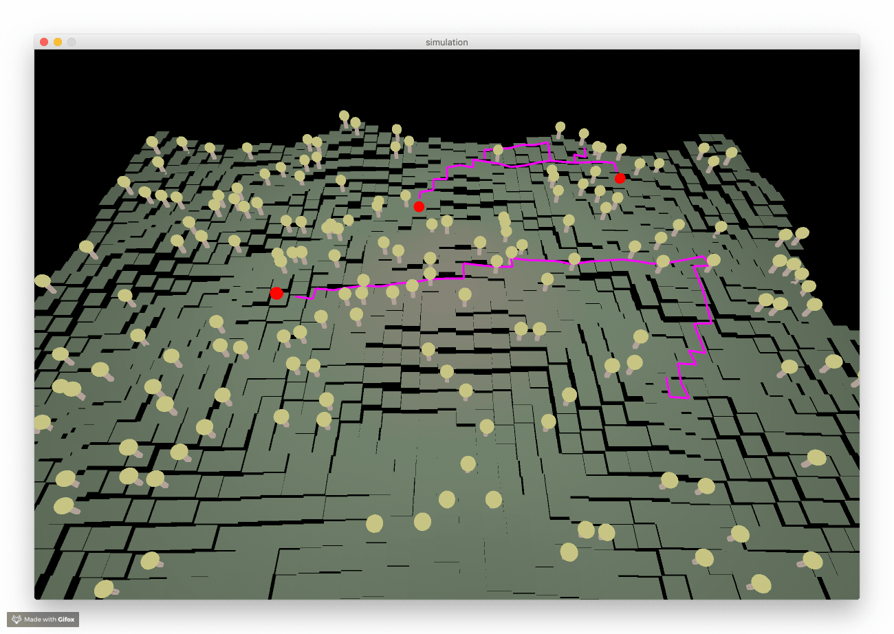

# Forestry

A simulation of some people walking around a forest. They ask a server where to
go. Over time, they will report on the flora and fauna they discover and be able
to complete jobs created by this server.

## Why?

I want to play with complex distributed systems. But I don't have a good use for
them. These little lumberjacks can be my users whilst I build effective ways to
manage their work.

## Running

1. Start up your server. My example one can be run with `ruby
   engine-sinatra/engine.rb`
1. Open the simulation with [Processing](https://processing.org) and set the
   path to your server as `baseUrl` in `Client.pde`.



## Example solutions

This repo includes basic example solutions which are used to test the
simulation's challenges.

```
$ bundle install
$ bundle exec ruby example_solutions/challenge_1.rb
```

# With thanks

Many thanks to:

* Red Blob Games for [_the_ A\*
  guide](https://www.redblobgames.com/pathfinding/a-star/introduction.html)
